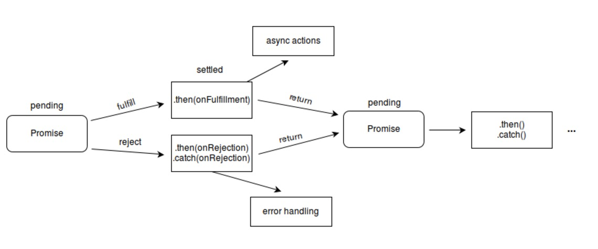

# ismorphic-promise

> 同构JS promise异步处理模块

## static methods

> Promise.all 等待所有的Promise都达到fulfilled的状态，任何一个Promise到达rejected都会触发 catch抛错

> Promise.race 等待所有的Promise中第一个达到fulfilled或者rejected的状态，即执行最后的then、catch结果

> Promise.resolve 直接处理fulfilled返回结果

> Promise.reject 直接处理reject的报错

## prototype methods原型链方法

> prototype.then 处理Promise的resolve返回

> prototype.catch 处理Promise的reject返回

